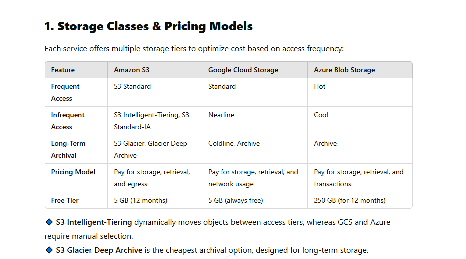
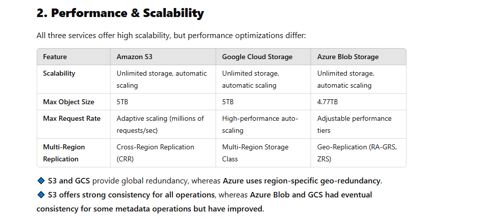
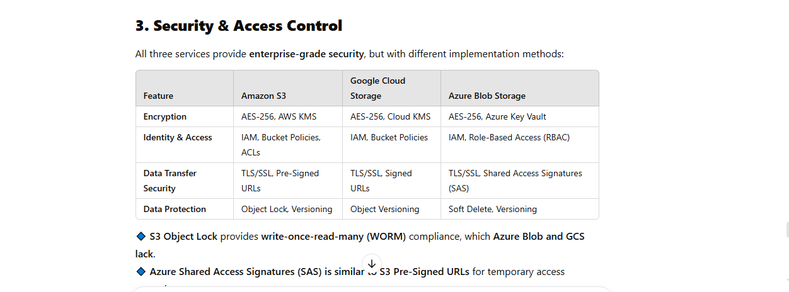
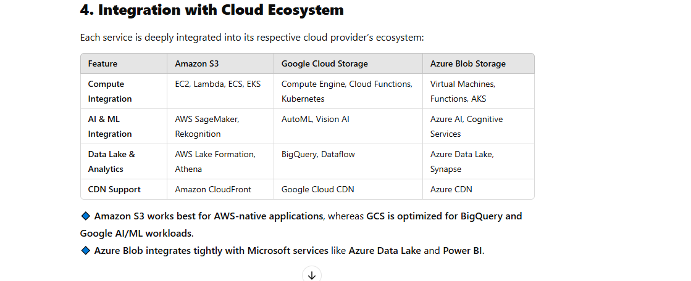
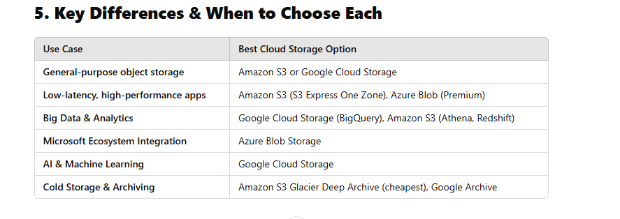

AWS Critical Thinking Projects and Questions

Cloud Storage Solutions and S3

Introduction to Cloud Storage:

What are the different types of cloud storage services (block, file, and object storage)? Which type of storage is Amazon S3?

Types of Cloud Storage Services
Cloud storage is categorized into three primary types based on how data is structured, accessed, and managed:

Block Storage

Data is stored in fixed-sized blocks, similar to traditional hard drives.

Used for high-performance, low-latency workloads such as databases and virtual machines (VMs).

Example cloud services:

Amazon EBS (Elastic Block Store)

Azure Managed Disks

Google Persistent Disks

File Storage

Data is stored in a hierarchical file system (like a traditional NAS).

Used for applications requiring shared access and structured file organization.

Supports standard file protocols like NFS (Linux) and SMB (Windows).

Example cloud services:

Amazon EFS (Elastic File System)

Azure Files

Google Filestore

Object Storage

Data is stored as objects in a flat namespace, each with metadata and a unique identifier (key).

Ideal for scalable, unstructured data such as images, videos, backups, and logs.

Provides high durability and availability with built-in redundancy.

Example cloud services:

Amazon S3 (Simple Storage Service)

Azure Blob Storage

Google Cloud Storage

Which Type of Storage is Amazon S3?

Amazon S3 is an object storage service. It is designed for scalable, durable, and highly available storage of unstructured data such as images, videos, backups, and large datasets.

Why Amazon S3 is Object Storage?

✅ Scalability – Stores massive amounts of unstructured data.

✅ Metadata Support – Each object has custom metadata for easy classification.

✅ Flat Namespace – Unlike hierarchical file systems, objects are stored in buckets and accessed via unique keys.

✅ Access via APIs – Uses RESTful API, SDKs, and CLI for management.

✅ Durability & Availability – Provides 99.999999999% (11 9’s) durability with multi-region redundancy.

What are the key features of Amazon S3 (durability, availability, scalability, and security)?

Key Features of Amazon S3

Amazon S3 (Simple Storage Service) is a highly scalable, durable, and secure object storage service. Its key features include:

1. Durability 

11 nines durability (99.999999999%): S3 automatically replicates data across multiple facilities within a region to prevent data loss.

Protects against hardware failures, accidental deletions, and natural disasters.

Versioning support: Retains multiple versions of an object to recover from unintended deletions or modifications.

S3 Object Lock: Prevents object deletion or modification for compliance and ransomware protection.

2. Availability 

Designed for 99.99% availability (higher with Multi-AZ replication).

Offers S3 Standard, S3 Intelligent-Tiering, and S3 One Zone-IA options for different availability needs.

Cross-Region Replication (CRR): Replicates objects across AWS regions for disaster recovery.

Multi-AZ Storage: Objects are stored across multiple AWS availability zones to ensure accessibility even if one zone fails.

3. Scalability 

Virtually unlimited storage: No predefined capacity limits; scales dynamically with usage.

Handles millions of requests per second, making it ideal for big data, media streaming, and large-scale applications.

Event-driven architecture: Integrates with AWS Lambda, SNS, and SQS for real-time processing.

4. Security 

Encryption at Rest: Uses AES-256 and AWS Key Management Service (KMS) for object encryption.

Encryption in Transit: Enforces TLS/SSL (HTTPS) for secure data transfer.

Identity & Access Management (IAM): Fine-grained access control with IAM policies, bucket policies, and Access Control Lists (ACLs).

Block Public Access: Prevents accidental public exposure of sensitive data.

Pre-signed URLs: Provides temporary access to objects without modifying permissions.

AWS CloudTrail & AWS Config: Tracks access and changes for compliance and auditing.

How does Amazon S3 differ from other cloud storage services like Google Cloud Storage and Microsoft Azure Blob?

Amazon S3 vs. Google Cloud Storage vs. Microsoft Azure Blob Storage
While Amazon S3, Google Cloud Storage (GCS), and Microsoft Azure Blob Storage all provide scalable object storage, they differ in key areas such as pricing models, performance, and integration with their respective cloud ecosystems.

Benefits of Using Amazon S3

Amazon S3 (Simple Storage Service) is a highly scalable, secure, and cost-effective object storage service designed for a variety of workloads. Here’s why it stands out:

1. Cost-Effectiveness 💰

Amazon S3 provides flexible pricing based on storage usage, retrieval frequency, and data transfer.

✅ Pay-as-you-go model – No upfront costs, only pay for what you use.

✅ Multiple storage classes to optimize cost:

S3 Standard – For frequently accessed data.

S3 Intelligent-Tiering – Automatically moves data between access tiers.

S3 Standard-IA & One Zone-IA – Lower-cost options for infrequent access.

S3 Glacier & Glacier Deep Archive – Ultra-low-cost archival storage.

✅ Lifecycle Policies – Automatically transition objects to cheaper storage classes.

✅ Data Compression & Deduplication – Reduce storage costs.

✅ Reserved Capacity Pricing – Offers discounts for predictable workloads.

💡 Example: Storing 1TB of rarely accessed data in S3 Glacier Deep Archive costs only $1 per month, making it much cheaper than traditional on-premise storage.

2. Ease of Use 🛠️

Amazon S3 simplifies storage management, access, and integration with AWS services.

✅ Simple Web Interface & CLI – Easy to manage and configure buckets via the AWS Management Console, CLI, or SDKs.

✅ Pre-Signed URLs – Securely share files without modifying permissions.

✅ Automatic Scaling – No need to provision capacity; scales automatically.

✅ S3 Select – Query data directly from S3 without downloading full datasets.

✅ Seamless AWS Integration – Works with AWS Lambda, CloudFront, AWS Backup, and more.

✅ Multi-Region Replication – Easy data backup across multiple AWS regions.

 Example: You can upload, retrieve, and manage files in Amazon S3 within minutes without setting up complex infrastructure.

3. Flexibility & Performance 🚀
Amazon S3 is highly flexible and performant, supporting diverse use cases like media storage, backups, and big data analytics.

✅ Virtually Unlimited Storage – Supports exabytes of data with no capacity limits.

✅ Fast Performance – Handles millions of requests per second with low latency.

✅ Data Lake Capabilities – Integrates with AWS analytics services like Athena, Redshift, and Glue.

✅ Content Delivery Optimization – Works with Amazon CloudFront (CDN) for fast, global content delivery.

✅ High Availability & Durability – 99.999999999% (11 9s) durability and 99.99% availability.

✅ Supports Custom Metadata – Useful for managing large datasets and AI/ML workloads.

 Example: A video streaming platform can use S3 to store and serve thousands of videos globally with low latency by integrating with CloudFront.

How does Amazon S3 integrate with other AWS services (S3 bucket policies, IAM roles, EC2, CloudFront, and Lambda)?

 Amazon S3 (Simple Storage Service) integrates with various AWS services to provide a seamless cloud storage solution. Below are key integrations with S3 bucket policies, IAM roles, EC2, CloudFront, and Lambda:

1. S3 Bucket Policies

S3 bucket policies control access to S3 buckets and objects. These policies are JSON-based and allow you to define permissions for specific AWS accounts, IAM users, or roles.

Used to allow or deny access based on conditions (IP restrictions, VPC endpoints, MFA, etc.).

Example: A bucket policy allowing public read access for a specific bucket while denying access from certain IP ranges.

2. IAM Roles and Policies
IAM roles and policies enable fine-grained access control over S3 resources.

IAM roles can be assigned to AWS services (e.g., EC2, Lambda) to allow access to S3.

Policies define what actions (e.g., s3:GetObject, s3:PutObject) an entity (user, role, service) can perform on an S3 bucket.

Example: An EC2 instance with an IAM role that grants read/write access to a specific S3 bucket.

3. Integration with EC2

EC2 instances interact with S3 for storage, backups, and application data access.

EC2 instances with an IAM role can access S3 securely without storing credentials.

S3 CLI, SDKs, and REST API enable data transfer between EC2 and S3.

S3 VPC Gateway Endpoint allows secure access to S3 from EC2 within a VPC without traversing the public internet.

Example: Storing application logs in S3 from an EC2 web server.

4. Integration with CloudFront (Content Delivery Network - CDN)

Amazon CloudFront works with S3 to deliver content with low latency and high availability.

S3 can be used as an origin for CloudFront, caching content at edge locations worldwide.

CloudFront Origin Access Control (OAC) or Origin Access Identity (OAI) restricts direct S3 access, ensuring traffic passes through CloudFront.

Example: Serving images, videos, or static website assets stored in S3 through CloudFront for faster content delivery.

5. Integration with AWS Lambda

AWS Lambda can be triggered by S3 events to execute serverless operations.

S3 Event Notifications trigger Lambda functions on events like PUT, DELETE, or COPY.

Use cases:

Automatic image resizing when a file is uploaded.

Data transformation and movement between S3 buckets.

Log processing (e.g., parsing, filtering logs).

Example: A Lambda function automatically processes and tags newly uploaded images in an S3 bucket.

Conclusion

Amazon S3 integrates deeply with AWS services, enabling powerful storage, security, and automation capabilities. These integrations enhance performance, scalability, and security for cloud applications.

What are the best practices for using Amazon S3 (data encryption, access control, and data lifecycle management)?

 To optimize security, cost, and efficiency when using Amazon S3, follow these best practices for data encryption, access control, and data lifecycle management.

1. Data Encryption (Protecting Data at Rest and In Transit)

🔹 Encrypt Data at Rest

Use S3 Default Encryption to automatically encrypt objects at upload.

Choose an encryption method:

Server-Side Encryption (SSE)

SSE-S3: Managed by AWS using S3-managed keys.

SSE-KMS: Uses AWS KMS for key management with fine-grained access control.

SSE-C: Customer-provided encryption keys.

Client-Side Encryption: Encrypt objects before uploading to S3 using AWS SDKs or third-party tools.

🔹 Encrypt Data in Transit

Use HTTPS (TLS 1.2/1.3) to secure data transfers.

Enforce SSL/TLS by restricting bucket access to HTTPS via an S3 bucket policy.

2. Access Control (Restricting Who Can Access S3 Data)

🔹 Follow the Principle of Least Privilege

Use IAM roles and policies to grant the minimum required permissions.

Avoid using wildcards (*) in permissions unless necessary.

🔹 Use S3 Bucket Policies for Fine-Grained Access

Block public access unless required (Enable "Block Public Access").

Define JSON-based policies to grant or deny access based on conditions (e.g., IP address, VPC endpoint).

Example: Restrict access to specific IAM users or AWS services.

🔹 Use AWS IAM Roles Instead of Access Keys

Assign IAM roles to EC2, Lambda, or ECS to access S3 securely.

Avoid embedding AWS credentials in applications.

🔹 Enable AWS S3 Access Logs

Enable Server Access Logging or AWS CloudTrail to monitor access and detect anomalies.

🔹 Use S3 Object Ownership (Bucket Owner Enforced Mode)

Ensure bucket owner full control to prevent issues with cross-account object uploads.

3. Data Lifecycle Management (Cost Optimization & Retention Policies)

🔹 Use S3 Lifecycle Policies

Automatically transition objects between storage classes or delete old data.

Example policies:

Move infrequently accessed data from S3 Standard → S3 IA (Infrequent Access) after 30 days.

Archive older objects to S3 Glacier after 90 days.

Delete objects after 365 days to manage storage costs.

🔹 Choose the Right S3 Storage Class

S3 Standard: Frequently accessed data.

S3 Intelligent-Tiering: Automated cost optimization for unpredictable access patterns.

S3 Standard-IA / One Zone-IA: Lower-cost storage for infrequent access.

S3 Glacier / Deep Archive: Long-term archival and compliance storage.

🔹 Enable Versioning to Prevent Data Loss

Use S3 Versioning to keep multiple versions of an object.

Protect against accidental deletions by enabling MFA Delete.

🔹 Set Object Expiration for Cleanup

Define object expiration rules to delete old versions or expired logs automatically.

Conclusion

By implementing encryption, strict access control, and lifecycle management, you can secure and optimize S3 storage for performance, cost, and compliance. 

Storage Solution for Large E-Commerce Website Assets:

Recommend a storage solution to address the performance impact of storing large assets for an e-commerce website running on your infrastructure. Consider factors such as scalability, performance, cost, and ease of management in your recommendation.

Recommended Storage Solution: Amazon S3 + Amazon CloudFront + Amazon S3 Intelligent-Tiering

1. Amazon S3 (Primary Object Storage)

Scalability: Handles unlimited storage and scales automatically.

Performance: High availability with low-latency access.

Cost-Efficiency: Different storage classes reduce costs based on access frequency.

Ease of Management: Fully managed by AWS with lifecycle policies and automation.

Storage Optimization with S3 Intelligent-Tiering

Automatically moves objects between frequent and infrequent access tiers based on usage patterns.

Reduces storage costs for assets that are not always accessed frequently (e.g., old product images).

No impact on performance since frequently accessed assets remain in the high-performance tier.

2. Amazon CloudFront (Content Delivery Network - CDN)

Enhances Performance: Caches images and assets at edge locations worldwide for low-latency delivery.

Reduces Load on S3: Minimizes direct S3 requests by serving cached copies.

Cost Optimization: Reduces S3 retrieval costs by serving content closer to users.

Security: Works with AWS Shield and WAF for protection against attacks.

Optimized Setup with CloudFront

Origin: S3 bucket configured as the origin.

Cache Policies: Set longer cache expiration times for static assets (e.g., product images).

Access Control: Use Origin Access Control (OAC) to restrict direct access to S3.

3. Amazon S3 Lifecycle Policies (Cost Optimization)

Automatically transitions older assets to lower-cost storage classes.

Example lifecycle policy:

Move images to S3 Standard-IA after 30 days.

Archive rarely used assets to S3 Glacier after 180 days.

Alternative Considerations

Amazon Elastic File System (EFS)
Suitable if the e-commerce site runs on EC2 and needs shared 

storage for multiple servers.

Scales automatically and provides high availability.

Higher cost compared to S3 for static assets.

Amazon FSx for Lustre

Recommended for high-performance computing (HPC) or applications needing very low latency file access.

Integrates with S3 to offload inactive data.

Final Recommendation: S3 + CloudFront + S3 Intelligent-Tiering

✅ Best for scalability (Handles large asset volumes).

✅ Optimized performance (Low-latency access with CloudFront).

✅ Cost-efficient (Intelligent-Tiering and lifecycle policies reduce storage costs).

✅ Easier management (Fully managed AWS services).

Security Strategy for Object Storage:

Develop a comprehensive security strategy for storing 30 internal videos in object storage, addressing encryption, access controls, and monitoring measures to protect the videos from unauthorized access and ensure data security.

To securely store 30 internal videos in Amazon S3 while protecting them from unauthorized access, the strategy will focus on encryption, access controls, and monitoring measures.

1. Data Encryption (Protecting Videos at Rest and in Transit)

🔹 Encryption at Rest
Enable Server-Side Encryption (SSE-KMS)

Use AWS Key Management Service (KMS) for encryption.

Define strict key policies to control who can use the encryption key.

Rotate keys periodically for enhanced security.

Enable Bucket Encryption by Default

Enforce encryption for all objects uploaded to the S3 bucket.

🔹 Encryption in Transit

Enforce HTTPS (TLS 1.2/1.3) for all data transfers.

Restrict access to S3 via VPC Gateway Endpoint to prevent exposure to the public internet.

2. Access Controls (Restricting Unauthorized Access)

🔹 S3 Bucket and Object Access Policies
Block Public Access: Ensure the bucket is private by default.

Bucket Policy:

Allow only specific IAM roles and users within the organization.

Restrict access based on IP addresses (e.g., allow access only from the corporate network).

Deny uploads that don’t meet encryption requirements.

🔹 IAM Role-Based Access Control (RBAC)

Create IAM Roles for specific access levels:

Admin Role: Full access for security and compliance teams.

Uploader Role: Users who can upload but not delete.

Viewer Role: Read-only access for authorized employees.

Apply the Principle of Least Privilege (PoLP) to restrict access only to those who need it.

Enable Multi-Factor Authentication (MFA) for IAM users with elevated permissions.

🔹 Pre-Signed URLs for Temporary Access

Use AWS SDK to generate pre-signed URLs for temporary access to videos.

Define expiration times to limit exposure.

3. Monitoring and Auditing (Detecting Unauthorized Access and Anomalies)

🔹 AWS CloudTrail for Auditing
Enable CloudTrail logging to monitor all access attempts and modifications to the S3 bucket.

Configure alerts on suspicious activities (e.g., failed access attempts, unauthorized IPs).

🔹 Amazon S3 Access Logs

Enable server access logging to track who accessed the videos and when.

Store logs in a separate secure S3 bucket with restricted access.

🔹 AWS Security Hub & GuardDuty

Use AWS Security Hub for centralized security monitoring.

Enable Amazon GuardDuty to detect unusual access patterns or potential threats.

🔹 AWS Config for Compliance Monitoring

Create AWS Config rules to ensure the bucket:

Is not publicly accessible.

Has encryption enabled.

Uses versioning and MFA Delete to prevent accidental deletions.

4. Data Integrity & Backup Strategy

🔹 Enable S3 Object Versioning
Maintain previous versions of videos to protect against accidental deletion or corruption.

🔹 Implement S3 Replication for Backup

Configure Cross-Region Replication (CRR) to store backups in a separate AWS region.

Use Lifecycle Policies to delete outdated versions after a set period.

🔹 Enable MFA Delete

Prevent unauthorized deletions by requiring MFA authentication for delete actions.

5. Additional Security Enhancements

Restrict direct access to the S3 bucket by using AWS CloudFront (signed URLs & signed cookies).

Use AWS Lambda to automatically quarantine suspicious uploads.

Perform regular security audits to ensure policies are up to date.

Conclusion

By implementing encryption (SSE-KMS, TLS), strict access controls (IAM, bucket policies, signed URLs), and continuous monitoring (CloudTrail, GuardDuty, Security Hub), this strategy ensures internal videos remain secure from unauthorized access while maintaining compliance and operational efficiency

Disaster Recovery Planning:

Develop a disaster recovery plan for a cloud-based application, outlining strategies for data backup, redundancy, failover, and recovery procedures in the event of a catastrophic failure or natural disaster.

This Disaster Recovery (DR) Plan ensures business continuity for a cloud-based application by outlining data backup, redundancy, failover, and recovery procedures in case of catastrophic failure or natural disaster.

1. Disaster Recovery Strategies

🔹 Data Backup Strategy
Automated Backups

Enable AWS Backup (or equivalent) for regular, encrypted snapshots of databases, application servers, and storage.

Use Amazon S3 Versioning to retain multiple copies of critical files.

Enable Point-in-Time Recovery (PITR) for databases using Amazon RDS, DynamoDB, or MongoDB Atlas.

Offsite & Multi-Region Backups

Use Cross-Region Replication (CRR) for backups in a different AWS region.

Store long-term archives in Amazon S3 Glacier for cost-efficient disaster recovery.

Backup Retention Policy

Maintain daily backups for 30 days.

Archive monthly backups for 1 year.

🔹 Redundancy & High Availability

Multi-AZ Deployments

Deploy database instances in Multi-AZ mode (e.g., RDS Multi-AZ, MongoDB replica sets).

Run stateless applications behind an Auto Scaling Group across multiple Availability Zones (AZs).

Cross-Region Redundancy

Deploy a standby environment in a secondary region using AWS Elastic Disaster Recovery (DRS).

Use Amazon S3 cross-region replication for storage redundancy.

Infrastructure as Code (IaC) for Quick Recovery

Use Terraform or AWS CloudFormation to automate infrastructure provisioning.

Maintain IaC templates for fast deployment in a new region.

🔹 Failover Strategy

DNS Failover with Amazon Route 53

Use Route 53 health checks to detect failures.

Automatically reroute traffic to a secondary region during downtime.

Load Balancing & Auto Scaling

Use Elastic Load Balancer (ELB) to distribute traffic across healthy instances.

Enable Auto Scaling to handle traffic surges.

Containerized Application Recovery

Use Amazon ECS, EKS, or Kubernetes with automated scaling across regions.

2. Recovery Procedures

🛠️ Immediate Response & Incident Identification
Trigger AWS CloudWatch Alerts upon detecting application failures or performance degradation.

Security Team Initiates Incident Response Protocols (isolate affected resources, investigate logs).

Notify Stakeholders (engineering teams, management, customers if applicable).

🛠️ Recovery Scenarios

Scenario 1: Application Failure (Single AZ Outage)
Recovery Steps:

✅ Automatically failover to a healthy instance using Auto Scaling.

✅ Redirect traffic using Elastic Load Balancer (ELB).

✅ Restore lost transactions using database PITR or replica sync.

Scenario 2: Database Failure (Corruption or Deletion)
Recovery Steps:

✅ Restore from latest automated backup using RDS PITR.

✅ If the primary database is unavailable, promote a read replica to a primary instance.

✅ Reconnect application servers to the new database endpoint.

Scenario 3: Regional Failure (Natural Disaster or Full AWS 
Region Outage)
Recovery Steps:

✅ Failover to Secondary Region using pre-deployed infrastructure.

✅ Deploy application using Terraform/CloudFormation IaC in a backup region.

✅ Route DNS to the new region via Route 53 failover routing.

✅ Restore S3 data from Cross-Region Replication (CRR) backups.

✅ Validate application functionality and notify stakeholders.

3. Testing & Continuous Improvement

✅ Disaster Recovery Testing
Conduct quarterly failover drills.

Test database restores and backup recovery.

Simulate AWS region failure scenarios.

✅ Continuous Monitoring & Improvement
Enable AWS CloudTrail, GuardDuty, and Security Hub to detect security anomalies.

Regularly review IAM policies & security best practices.

Update disaster recovery documentation and procedures.

Conclusion

This DR plan ensures a resilient cloud-based application by implementing automated backups, multi-region redundancy, and failover strategies. Regular testing and monitoring further enhance disaster preparedness. 