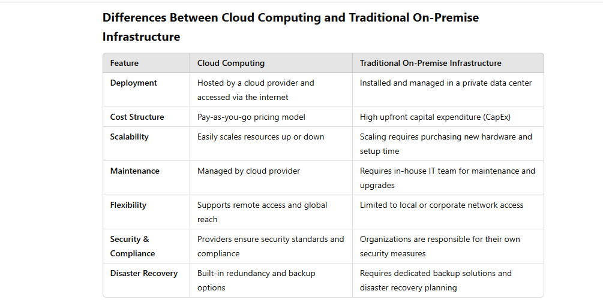
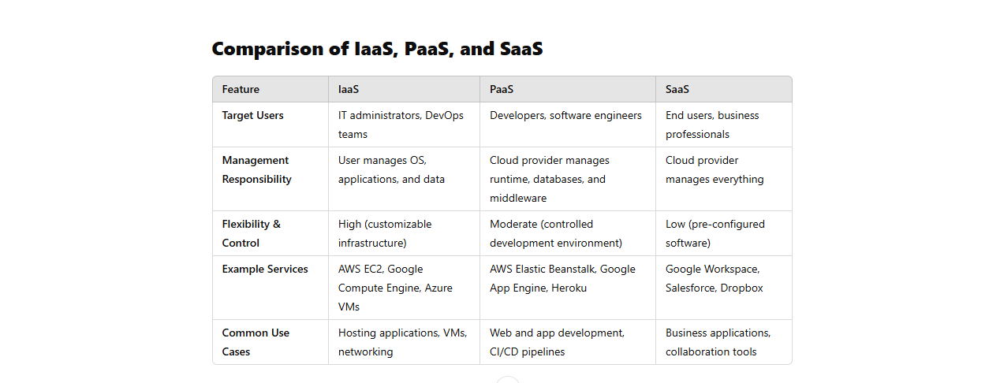
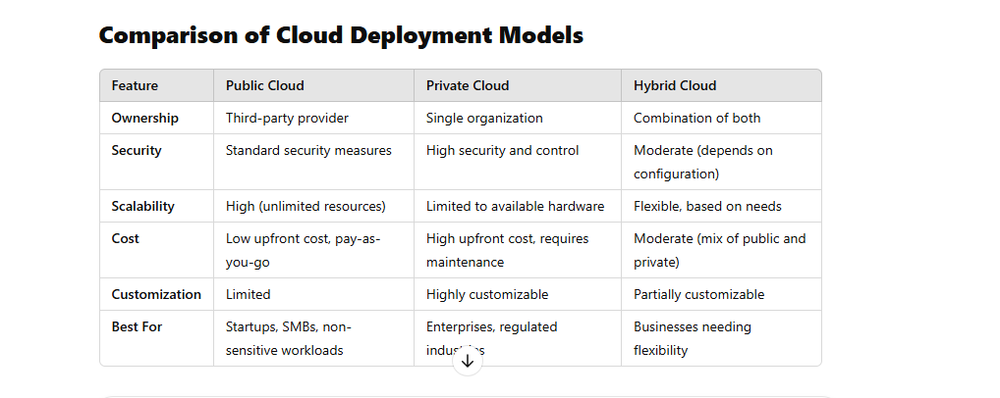
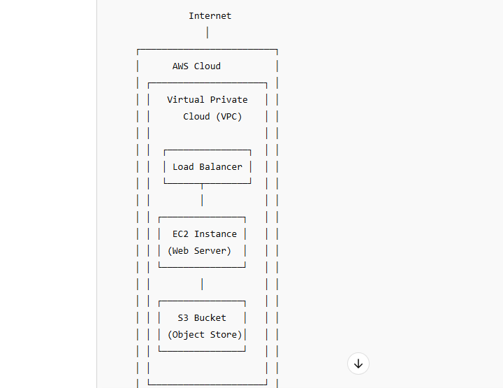
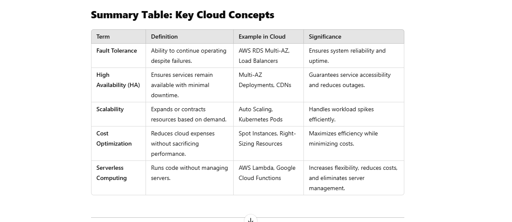
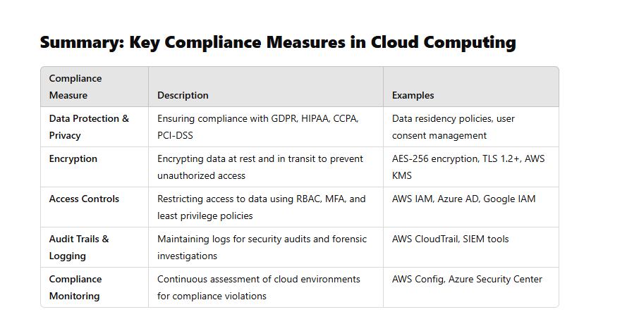
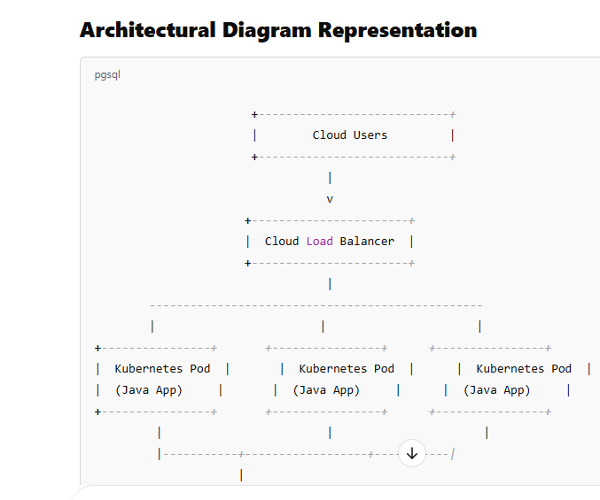

AWS Research Questions

AWS Critical Thinking Questions

Introduction to Cloud Computing Concepts

What is Cloud Computing? - Define cloud computing in your own words and describe its basic characteristics (on-demand access, scalability, etc.). How does cloud computing differ from traditional on-premise infrastructure?

Definition of Cloud Computing

Cloud computing is the delivery of computing services—including servers, storage, databases, networking, software, and analytics—over the internet ("the cloud") instead of relying on local, on-premise infrastructure. It allows users to access resources on demand, pay only for what they use, and scale efficiently based on workload needs.

Basic Characteristics of Cloud Computing:

On-Demand Access: Users can provision and manage computing resources as needed without human intervention from service providers.

Scalability: Cloud services can dynamically scale up or down based on demand, ensuring efficient resource utilization.
Pay-as-You-Go Pricing: Users only pay for the resources they consume, avoiding large upfront costs associated with traditional infrastructure.

Accessibility & Ubiquity: Resources can be accessed from anywhere with an internet connection, enabling remote work and collaboration.
Reliability & Redundancy: Cloud providers ensure high availability by distributing resources across multiple data centers.

Security & Compliance: Leading cloud providers implement robust security measures, including encryption, access control, and compliance with industry regulations.
Automation & Self-Service: Cloud platforms provide automation tools for provisioning, deployment, and management, reducing manual effort.

cloud computing provides a more flexible, cost-effective, and scalable alternative to traditional on-premise infrastructure, making it the preferred choice for businesses looking to optimize IT operations and enhance agility

Types of Cloud Computing Services: - Explain the differences between Infrastructure as a Service (IaaS), Platform as a Service (PaaS), and Software as a Service (SaaS). Provide examples of each and their use cases in the cloud.

Types of Cloud Computing Services

Cloud computing services are typically categorized into three main models: Infrastructure as a Service (IaaS), Platform as a Service (PaaS), and Software as a Service (SaaS). Each model provides different levels of control, management, and usability.
________________________________________
1. Infrastructure as a Service (IaaS)

IaaS provides virtualized computing resources over the internet, including servers, storage, networking, and virtualization. It allows businesses to rent infrastructure instead of purchasing and maintaining physical hardware.

Key Features of IaaS:

•	On-demand scalability of computing resources

•	Pay-as-you-go pricing model

•	Full control over operating systems, applications, and configurations

•	Suitable for IT administrators and DevOps teams
Examples of IaaS:

•	Amazon Web Services (AWS) EC2 – Virtual servers for hosting applications

•	Microsoft Azure Virtual Machines – Scalable cloud-based VMs

•	Google Compute Engine (GCE) – Compute instances in Google Cloud

•	IBM Cloud Infrastructure – Enterprise-grade virtual machines

Use Cases:

•	Hosting websites, applications, and databases

•	Running development and testing environments

•	Disaster recovery and backup solutions

•	Scalable business IT infrastructure

2. Platform as a Service (PaaS)

PaaS provides a development and deployment environment in the cloud, enabling developers to build, test, and manage applications without worrying about underlying infrastructure.

Key Features of PaaS:

•	Pre-configured runtime environments for application 
development

•	Automated infrastructure management

•	Support for multiple programming languages and frameworks

•	Integration with databases, middleware, and development tools

Examples of PaaS:

•	Google App Engine – A fully managed serverless platform 
for web apps

•	Microsoft Azure App Services – Hosting for web and mobile apps

•	AWS Elastic Beanstalk – Deploying and managing applications easily

•	Heroku – A cloud platform for developers to deploy apps
Use Cases:

•	Rapid development of web and mobile applications

•	Continuous integration and continuous deployment (CI/CD) workflows

•	Application modernization and microservices architecture

•	Hosting APIs and backend services

3. Software as a Service (SaaS)

SaaS delivers fully functional software applications over the internet, eliminating the need for installation, maintenance, or updates by end users.

Key Features of SaaS:

•	Subscription-based pricing

•	Accessible from any device with an internet connection

•	Automatic software updates and maintenance

•	Managed security and compliance
Examples of SaaS:

•	Google Workspace (Gmail, Docs, Drive, Meet) – Cloud-based productivity tools

•	Microsoft 365 (Word, Excel, Teams, Outlook) – Office software suite

•	Salesforce – Cloud-based customer relationship management (CRM)

•	Dropbox – Cloud storage and file sharing

•	Zoom – Video conferencing and collaboration
Use Cases:

•	Cloud-based email and communication tools

•	Customer relationship management (CRM) systems

•	Enterprise resource planning (ERP) solutions

•	File storage and collaboration

Understanding the differences between IaaS, PaaS, and SaaS is crucial when selecting the right cloud service model. Businesses looking for flexibility and control over infrastructure may choose IaaS, while developers who need an easy-to-use development environment prefer PaaS. For organizations seeking ready-to-use software without management overhead

Cloud Deployment Models

Cloud deployment models define how cloud resources are managed, accessed, and utilized based on the level of control, security, and accessibility required by an organization. The three main cloud deployment models are Public Cloud, Private Cloud, and Hybrid Cloud.

1. Public Cloud The public cloud is a cloud computing model where computing resources (such as servers, storage, and applications) are owned and managed by third-party cloud providers and made available to multiple users over the internet.

Characteristics:

•	Hosted and managed by a cloud provider (e.g., AWS, Microsoft Azure, Google Cloud)

•	Shared infrastructure among multiple users (multi-tenancy)

•	Pay-as-you-go pricing model

•	Scalable and flexible resource allocation

•	Lower operational and maintenance costs

Use Cases:

 Startups and small businesses needing cost-effective infrastructure

 Businesses with unpredictable or variable workloads

 Hosting websites, applications, and databases

 Development and testing environments

Data backup and disaster recovery solutions

Examples of Public Cloud Providers:

•	Amazon Web Services (AWS)

•	Microsoft Azure

•	Google Cloud Platform (GCP)

•	IBM Cloud
________________________________________

2. Private Cloud

The private cloud is a cloud environment dedicated exclusively to a single organization. It can be hosted on-premise in a company’s data center or by a third-party 
provider but remains private to one entity.

Characteristics:

•	Dedicated resources for a single organization

•	Enhanced security, privacy, and compliance control

•	Can be hosted on-premise or by a private cloud provider

•	Requires significant investment in infrastructure and maintenance

•	Customizable to meet specific business and regulatory needs

Use Cases:

 Enterprises with strict security and compliance requirements (e.g., healthcare, finance, government)
 Organizations needing full control over their infrastructure
 Large corporations running mission-critical applications
 Companies with predictable and consistent workloads

Examples of Private Cloud Solutions:

•	VMware Cloud

•	OpenStack

•	Microsoft Azure Stack

•	Red Hat OpenShift
________________________________________

3. Hybrid Cloud

The hybrid cloud is a combination of public and private cloud infrastructures, allowing data and applications to be shared between them. This model provides flexibility by enabling businesses to run sensitive workloads on a private cloud while leveraging the scalability of the public cloud.

Characteristics:

•	Integrates public and private cloud environments

•	Offers flexibility to move workloads between clouds

•	Balances cost-effectiveness with security and compliance

•	Supports burstable workloads (scaling to the public cloud when demand spikes)

•	Requires proper integration and network connectivity

Use Cases:

 Businesses needing a balance between security and scalability

Organizations with sensitive data that must remain on-premise but require cloud-based analytics or processing

 Companies handling temporary workload spikes (e.g., retail during holiday seasons)

 Disaster recovery and business continuity solutions

Examples of Hybrid Cloud Solutions:

•	AWS Outposts

•	Microsoft Azure Hybrid Cloud

•	Google Anthos

•	IBM Hybrid Cloud

 
 
 Benefits of Cloud Computing: - What are the key benefits of cloud computing compared to traditional data centers? Focus on aspects such as cost, scalability, reliability, and speed of deployment.

Key Benefits of Cloud Computing Compared to Traditional Data Centers

Cloud computing offers several advantages over traditional on-premise data centers, particularly in terms of cost, scalability, reliability, and speed of deployment.

1. Cost Efficiency 

Reduced Capital Expenditure (CapEx) – Traditional data centers require upfront investments in hardware, networking, and facilities, whereas cloud computing follows a pay-as-you-go (PAYG) model, significantly reducing capital costs.

 Operational Cost Savings – No need for on-premises power, cooling, or IT maintenance, as cloud providers handle infrastructure management.

 Optimized Resource Utilization – Auto-scaling and serverless computing models ensure that businesses pay only for the resources they use.

2. Scalability & Elasticity 

 On-Demand Resource Scaling – Cloud platforms allow horizontal and vertical scaling to handle traffic spikes without downtime.

 Global Reach & Edge Computing – Cloud providers offer content delivery networks (CDNs) and multi-region deployments, ensuring seamless performance worldwide.

 Elasticity – Businesses can quickly scale up or down based on demand, optimizing cost and performance.

3. Reliability & High Availability 

 Redundant Infrastructure – Cloud providers offer geo-redundancy, ensuring data and applications remain available even if a failure occurs in one region.

 Disaster Recovery & Backup – Automated snapshots, backups, and failover solutions minimize downtime and data loss.

 99.9%+ SLA Uptime – Leading cloud providers guarantee high availability through load balancing, distributed storage, and failover mechanisms.

4. Speed & Agility in Deployment 

Faster Provisioning – Deploy virtual machines, containers, and applications in minutes compared to the weeks or months needed for traditional infrastructure.

Automated CI/CD Pipelines – DevOps integration with cloud platforms allows continuous deployment and testing.

Infrastructure as Code (IaC) – Tools like Terraform, Ansible, and CloudFormation enable rapid, repeatable, and version-controlled infrastructure deployment.

5. Security & Compliance 

 Cloud Security Best Practices – Providers implement built-in encryption, identity management (IAM), and compliance certifications (PCI-DSS, SOC 2, HIPAA).

 Automated Threat Detection – AI-powered security monitoring identifies and mitigates risks in real time.

Conclusion

Cloud computing outperforms traditional data centers in cost, scalability, reliability, speed, and security. It enables businesses to innovate faster, reduce IT overhead, and enhance application performance, making it the preferred choice for modern enterprises. 

Concerns around Cloud Computing: - Discuss the potential challenges and risks associated with cloud computing, including data security, compliance issues, vendor lock-in, and downtime 

Concerns Around Cloud Computing

While cloud computing offers numerous benefits, such as scalability, cost-efficiency, and flexibility, it also comes with challenges and risks that organizations must consider. Below are some key concerns:

1. Data Security Risks
Storing sensitive data in the cloud raises concerns about unauthorized access, data breaches, and cyberattacks. Cloud environments are shared by multiple users (multi-tenancy), increasing the risk of exposure.

Key Challenges:

Data Breaches – Hackers can exploit vulnerabilities in cloud services to access confidential information.

Insider Threats – Employees or service providers with access to cloud systems can misuse data.

Encryption & Key Management – Ensuring data is encrypted during transit and at rest, with proper key management, is critical.

Mitigation Strategies:

✔ Implement strong encryption and access control mechanisms

✔ Use multi-factor authentication (MFA) and role-based access control (RBAC)

✔ Regularly conduct security audits and penetration testing

2. Compliance and Regulatory Issues
Organizations operating in regulated industries (e.g., healthcare, finance, government) must comply with strict data protection laws, such as GDPR, HIPAA, and PCI-DSS. Cloud providers may not always align with these compliance requirements.

Key Challenges:

Data Sovereignty – Cloud providers store data in global data centers, leading to legal concerns about where data is processed.

Audit & Monitoring – Businesses must ensure cloud providers comply with industry regulations.

Mitigation Strategies:

✔ Choose cloud providers that support compliance with industry standards

✔ Verify data residency and sovereignty policies before storing data

✔ Implement logging and monitoring tools to track compliance

3. Vendor Lock-In

Vendor lock-in occurs when organizations become dependent on a single cloud provider, making it difficult to switch providers due to proprietary technologies, high migration costs, or compatibility issues.

Key Challenges:

Limited Interoperability – Different cloud platforms use unique APIs and services, making migration complex.

Expensive Exit Costs – Moving applications and data from one cloud provider to another can be costly.

Service Disruptions – Some features may not be available on other cloud platforms, leading to compatibility issues.

Mitigation Strategies:

✔ Adopt multi-cloud or hybrid cloud strategies to reduce dependence on a single provider

✔ Use open-source and cloud-agnostic technologies (e.g., Kubernetes, Terraform)

✔ Develop an exit strategy before committing to a cloud provider

4. Downtime and Service Reliability
Cloud services rely on internet connectivity and data center availability. If a cloud provider experiences downtime, businesses may face disruptions in critical applications.

Key Challenges:

Outages and Downtime – Even top cloud providers experience occasional downtime (e.g., AWS, Azure, Google Cloud outages).

Latency Issues – Performance may be affected by internet speed, geographic location, and network congestion.

Data Loss – Unexpected failures or misconfigurations can lead to data corruption or loss.

Mitigation Strategies:

✔ Choose a provider with high uptime SLAs (Service Level Agreements)

✔ Implement redundancy and failover strategies across multiple regions or providers

✔ Regularly back up data to secondary locations or on-premise

Despite its challenges, cloud computing remains a powerful 
solution for businesses looking to scale and innovate. By 

addressing security, compliance, vendor lock-in, and 

reliability concerns with proactive strategies, 

organizations can leverage cloud computing while minimizing risks

Here's a simple diagram representing a basic cloud architecture using key AWS services like Compute (EC2), Storage (S3), and Networking (VPC):

Basic Cloud Architecture Diagram

Description of Each Service & Interaction
Virtual Private Cloud (VPC) - Networking Layer

A VPC provides an isolated network for AWS resources.

The VPC Subnet contains compute resources like EC2 instances.

The Internet Gateway (IGW) allows public access to resources.

Compute (EC2 Instance) - Web Server

An EC2 instance runs applications (e.g., a web server like Apache, Nginx).

It interacts with S3 for static content like images, videos, and backups.

It is accessible via a Load Balancer for distributing traffic.

Storage (S3 Bucket) - Object Storage

S3 stores website assets, logs, and backups.

EC2 retrieves static files (e.g., CSS, images) from S3 to serve web pages.

S3 provides high availability and durability for stored objects.

Load Balancer (Optional for Scaling)

If multiple EC2 instances exist, an Elastic Load Balancer (ELB) distributes traffic evenly.

Ensures high availability and fault tolerance.

How Services Interact:
A user requests a web page via the internet.

The request is routed through the Load Balancer to an EC2 instance.

The EC2 instance processes the request and fetches dynamic content.

If needed, EC2 retrieves static assets (images, videos) from S3.

The EC2 instance returns the response to the user.

Explanation of Terms: - Define and provide examples for terms such as fault tolerance, high availability, scalability, cost optimization, and serverless computing, illustrating their significance in the context of IT infrastructure and cloud services.

Explanation of Key Cloud Computing Terms

1. Fault Tolerance
Definition:
Fault tolerance refers to a system’s ability to continue operating properly despite failures in hardware, software, or network components. A fault-tolerant system automatically detects and recovers from failures without service interruption.

Example in Cloud Computing:

Amazon RDS Multi-AZ Deployment: In case of a database instance failure, Amazon RDS automatically switches to a standby instance in another availability zone without downtime.

Load Balancers with Multiple EC2 Instances: If one EC2 instance fails, the load balancer redirects traffic to other healthy instances.

Significance:

✔ Ensures business continuity

✔ Reduces downtime and revenue loss

✔ Enhances user experience and reliability

2. High Availability (HA)
Definition:

High availability ensures that cloud services and applications remain accessible and operational with minimal downtime. It typically involves redundancy and failover mechanisms.

Example in Cloud Computing:

AWS Availability Zones (AZs): Applications are deployed across multiple AZs, so if one data center fails, another takes over.

Content Delivery Networks (CDNs): 

Services like AWS CloudFront distribute content globally to reduce failures and latency.

Significance:

✔ Guarantees continuous service availability
✔ Reduces the risk of single points of failure
✔ Improves customer trust and satisfaction

3. Scalability

Definition:
Scalability refers to the ability of a system to handle increasing workloads by adding or removing resources as needed.

Types of Scalability:

Vertical Scaling (Scaling Up): Adding more CPU, RAM, or storage to a single server.

Horizontal Scaling (Scaling Out): Adding more servers or instances to distribute the load.

Example in Cloud Computing:

Auto Scaling Groups (AWS, Azure, GCP): Automatically adds or removes EC2 instances based on traffic demand.

Kubernetes Cluster Scaling: Automatically scales pods up or down based on resource usage.

Significance:

✔ Supports growth and traffic spikes

✔ Optimizes resource utilization and cost

✔ Improves application performance and responsiveness

4. Cost Optimization

Definition:

Cost optimization in cloud computing refers to efficiently using cloud resources while minimizing expenses without compromising performance.

Example in Cloud Computing:

AWS EC2 Reserved Instances: Instead of paying on-demand pricing, businesses can purchase Reserved Instances to save up to 75%.

Auto Scaling & Spot Instances: Dynamically scaling down during low traffic periods reduces unnecessary costs.

Best Practices for Cost Optimization:

✅ Right-Sizing Resources – Choose instance types based on actual workload.

✅ Auto Scaling & Scheduling – Shut down non-essential instances outside business hours.

✅ Serverless Computing – Pay only for the execution time of functions, reducing costs.

Significance:

✔ Maximizes ROI (Return on Investment)

✔ Prevents over-provisioning of resources

✔ Aligns costs with business demand

5. Serverless Computing

Definition:

Serverless computing is a cloud execution model where developers run code without managing infrastructure. The cloud provider dynamically allocates and manages resources.

Example in Cloud Computing:

AWS Lambda: Runs code in response to events (e.g., user requests, file uploads) without provisioning servers.

Google Cloud Functions: Automatically executes functions in response to HTTP requests or database changes.

Benefits of Serverless Computing:

✅ No server management – The provider handles provisioning and scaling.

✅ Pay-per-use pricing – Only charges for execution time and resources consumed.

✅ Scalability – Automatically scales based on demand.

Significance:

✔ Reduces operational complexity

✔ Enhances developer productivity

✔ Lowers infrastructure costs

Compliance Considerations in Cloud Computing: - Discuss the importance of compliance with industry regulations and data protection laws in cloud computing environments. Outline key compliance requirements and measures to ensure regulatory adherence, including data encryption, access controls, audit trails, and compliance monitoring.

Compliance Considerations in Cloud Computing
Why Compliance Matters in Cloud Computing?
Compliance in cloud computing is crucial for ensuring that organizations adhere to legal, regulatory, and industry-specific standards when storing, processing, and transferring data. Failure to comply can result in hefty fines, legal action, data breaches, and reputational damage.

Organizations using cloud services must ensure that cloud providers meet compliance standards and that their own configurations align with regulatory requirements.

Key Compliance Requirements in Cloud Computing

1. Data Protection and Privacy Laws
Cloud providers and businesses must comply with data privacy laws that govern how personal and sensitive data is collected, stored, and processed.

Examples:

GDPR (General Data Protection Regulation) – Protects personal data of EU citizens, requiring user consent and data sovereignty.

CCPA (California Consumer Privacy Act) – Grants California residents control over their personal data.

HIPAA (Health Insurance Portability and Accountability Act) – Regulates healthcare data privacy in the U.S.

PCI-DSS (Payment Card Industry Data Security Standard) – Ensures secure payment processing for businesses handling credit card transactions.

Compliance Measures:

✔ Encrypt personal and financial data at rest and in transit.

✔ Implement data residency policies to store user data within specific regions.

✔ Provide users with control over their data (e.g., data deletion requests under GDPR).

2. Data Encryption
Encryption ensures that data is unreadable to unauthorized users, preventing breaches and ensuring compliance with security regulations.

Encryption Best Practices:

At-Rest Encryption: Encrypt stored data using AES-256 encryption (e.g., AWS S3 Server-Side Encryption, Azure Storage Encryption).

In-Transit Encryption: Use TLS (Transport Layer Security) 1.2+ to secure data transmitted over networks.

Key Management: Use cloud-based Key Management Services (KMS) for secure encryption key storage and rotation.

✅ Example: AWS KMS, Azure Key Vault, Google Cloud KMS.

3. Identity and Access Controls
To prevent unauthorized access to sensitive data, organizations must enforce strict authentication and authorization policies.

Key Access Control Measures:

Role-Based Access Control (RBAC): Restrict data access based on user roles (e.g., Admins, Developers, Auditors).

Multi-Factor Authentication (MFA): Require additional authentication steps to strengthen user identity verification.

Least Privilege Principle: Users should have only the permissions necessary to perform their tasks.

✅ Example: AWS IAM, Azure AD, Google Cloud IAM.

4. Audit Trails and Logging
Organizations must maintain detailed logs of system access, modifications, and data transactions for compliance audits.

Best Practices for Audit Trails:

✔ Enable Cloud Logging & Monitoring (AWS CloudTrail, Azure Monitor, Google Cloud Logging).

✔ Retain logs for compliance-specific retention periods (e.
g., GDPR: Logs must be stored securely but not indefinitely).

✔ Regularly review logs for anomalies using SIEM (Security Information and Event Management) tools.

✅ Example: AWS CloudTrail logs all API requests for security auditing.

5. Compliance Monitoring & Continuous Assessment
To maintain compliance, businesses must continuously monitor and assess cloud environments for security risks and regulatory violations.

Key Compliance Monitoring Measures:

Automated Compliance Scanning: Tools like AWS Config, Azure Security Center, and Google Security Command Center assess configurations for compliance violations.

Third-Party Compliance Audits: Regular audits by independent firms verify adherence to industry standards.

Continuous Compliance Frameworks: Implement CIS Benchmarks, NIST 800-53, or ISO 27001 to align cloud security practices.

Choosing between Cloud and On-Premise Computing for Hosting a Java Containerized Application: - As an engineer tasked with choosing between cloud and on-premise computing for hosting a Java containerized application, explain your decision-making process and justify your choice based on factors such as scalability, cost, flexibility, and reliability. Additionally, outline an architectural diagram for hosting the application to serve 500 users at peak period

Key Considerations
1. Scalability
Cloud:

Auto-scaling capabilities allow the application to dynamically adjust resources based on demand.

Kubernetes-based orchestration in the cloud (e.g., AWS EKS, Azure AKS, GCP GKE) enables horizontal scaling as needed.

On-Premise:

Limited by hardware constraints; scaling requires manual hardware procurement and configuration.

More difficult to handle traffic spikes due to static infrastructure.

✅ Winner: Cloud – More flexible and efficient in handling user load variations.

2. Cost Considerations
Cloud:

Pay-as-you-go pricing ensures that you only pay for resources used.

Reduced CapEx (Capital Expenditure) since no upfront investment in hardware is required.

Can optimize costs using reserved instances or serverless options.

On-Premise:

High initial cost for purchasing and setting up hardware.

Ongoing operational costs (power, cooling, maintenance, IT personnel).

Potential underutilization of resources during non-peak hours.

✅ Winner: Cloud – Lower upfront costs and better cost optimization strategies.

3. Flexibility & Deployment Speed
Cloud:

Provides instant access to infrastructure, allowing for rapid deployment.

Supports multi-region deployments, ensuring faster response times.

Easily integrates with CI/CD pipelines for continuous deployment.

On-Premise:

Slower provisioning and setup of new resources.

Requires manual intervention for updates and scaling.

Deployment speed is limited by available IT staff and infrastructure.

✅ Winner: Cloud – Faster and more agile for deployment.

4. Reliability & Disaster Recovery
Cloud:

Built-in high availability (HA) and disaster recovery (DR) solutions.

Multi-region failover ensures that applications remain available even during failures.

Cloud providers offer 99.99% uptime SLAs.

On-Premise:

Requires redundant hardware and disaster recovery plans, which increase costs.

Single point of failure if not properly configured with backups and redundancy.

✅ Winner: Cloud – More reliable and easier to implement disaster recovery.

5. Security & Compliance
Cloud:

Major cloud providers comply with ISO 27001, SOC 2, GDPR, HIPAA, and PCI-DSS.

Features IAM (Identity and Access Management), encryption, and network security controls.

On-Premise:

More control over security, but requires dedicated security teams and tools.

Ensuring compliance with regulations involves high operational overhead.

✅ Winner: Depends – On-premise offers full control, but cloud providers offer robust security features with minimal effort.

Final Decision: Cloud-Based Deployment 🚀
Based on scalability, cost, flexibility, and reliability, 
the best option for hosting a Java containerized application 

serving 500 peak users is Cloud Computing.

Cloud Kubernetes Service (AWS EKS, Azure AKS, or GCP GKE) for container orchestration.

Managed Database (AWS RDS, Azure SQL, or Google Cloud SQL) to handle data persistence.

Load Balancer (AWS ALB, Azure Application Gateway, or GCP Load Balancer) to distribute traffic.

✅ This ensures cost efficiency, automatic scaling, and high availability.

Proposed Cloud Architecture Diagram
Components & Workflow

1️⃣ Users (Clients) access the application via a web/mobile interface.

2️⃣ Requests go through a Cloud Load Balancer, which distributes traffic evenly.

3️⃣ The Kubernetes Cluster (EKS/AKS/GKE) manages Java-based containerized microservices.

4️⃣ The Managed Database (RDS, Cloud SQL, etc.) handles persistent data storage.

5️⃣ A CI/CD Pipeline automates deployments, ensuring rapid feature releases.

